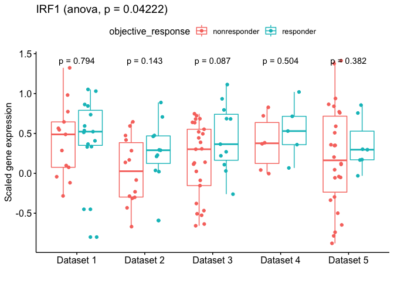

Explore response data!
================

-   [Test gene list for differences in response](#test-gene-list-for-differences-in-response)

<!-- html table generated in R 3.5.1 by xtable 1.8-3 package -->
<!-- Fri Oct 26 10:37:19 2018 -->
<table border="1">
<tr>
<th>
</th>
<th>
treatment
</th>
<th>
dataset\_anon
</th>
<th>
samples
</th>
</tr>
<tr>
<td align="right">
Hugo2016
</td>
<td>
PD1
</td>
<td>
Dataset 1
</td>
<td align="right">
28
</td>
</tr>
<tr>
<td align="right">
Prat2017
</td>
<td>
PD1
</td>
<td>
Dataset 2
</td>
<td align="right">
25
</td>
</tr>
<tr>
<td align="right">
Riaz2017
</td>
<td>
CTLA4
</td>
<td>
Dataset 3
</td>
<td align="right">
56
</td>
</tr>
<tr>
<td align="right">
TCGA
</td>
<td>
CTLA4
</td>
<td>
Dataset 4
</td>
<td align="right">
19
</td>
</tr>
<tr>
<td align="right">
VanAllen2015
</td>
<td>
CTLA4
</td>
<td>
Dataset 5
</td>
<td align="right">
42
</td>
</tr>
</table>
Scale data by dataset mean and standard deviation

Test gene list for differences in response
------------------------------------------

### Longer list

Of 715 genes of interest, 551 are represented by gene symbol in the IMPRES set.

For each of those, compute ANOVA for linear model, with dataset and objective\_response as effects.

Lowest p-values

<!-- html table generated in R 3.5.1 by xtable 1.8-3 package -->
<!-- Fri Oct 26 10:37:26 2018 -->
<table border="1">
<tr>
<th>
</th>
<th>
P-value
</th>
</tr>
<tr>
<td align="right">
CYFIP2
</td>
<td align="right">
0.00389
</td>
</tr>
<tr>
<td align="right">
CCR7
</td>
<td align="right">
0.01251
</td>
</tr>
<tr>
<td align="right">
NFKB2
</td>
<td align="right">
0.01308
</td>
</tr>
<tr>
<td align="right">
ST6GAL1
</td>
<td align="right">
0.01470
</td>
</tr>
<tr>
<td align="right">
CXCL13
</td>
<td align="right">
0.01984
</td>
</tr>
<tr>
<td align="right">
TNFRSF11B
</td>
<td align="right">
0.02134
</td>
</tr>
<tr>
<td align="right">
STAT3
</td>
<td align="right">
0.02381
</td>
</tr>
<tr>
<td align="right">
HSD11B1
</td>
<td align="right">
0.02519
</td>
</tr>
<tr>
<td align="right">
IL21R
</td>
<td align="right">
0.03024
</td>
</tr>
<tr>
<td align="right">
IL2RA
</td>
<td align="right">
0.03321
</td>
</tr>
<tr>
<td align="right">
CD3E
</td>
<td align="right">
0.03585
</td>
</tr>
<tr>
<td align="right">
SELE
</td>
<td align="right">
0.03623
</td>
</tr>
<tr>
<td align="right">
BCL6
</td>
<td align="right">
0.03764
</td>
</tr>
<tr>
<td align="right">
CARD11
</td>
<td align="right">
0.04001
</td>
</tr>
<tr>
<td align="right">
FLT3
</td>
<td align="right">
0.04090
</td>
</tr>
<tr>
<td align="right">
IL17RA
</td>
<td align="right">
0.04130
</td>
</tr>
<tr>
<td align="right">
IRF1
</td>
<td align="right">
0.04222
</td>
</tr>
<tr>
<td align="right">
NFKB1
</td>
<td align="right">
0.04280
</td>
</tr>
<tr>
<td align="right">
TLR8
</td>
<td align="right">
0.04307
</td>
</tr>
<tr>
<td align="right">
LTB
</td>
<td align="right">
0.04324
</td>
</tr>
</table>
Plots for top genes

### More focused list for SITC

Of 34 genes of interest, 27 are represented by gene symbol in the IMPRES set.

For each of those, compute ANOVA for linear model, with dataset and objective\_response as effects.

P-values for the genes of interest <!-- html table generated in R 3.5.1 by xtable 1.8-3 package --> <!-- Fri Oct 26 10:37:41 2018 -->
<table border="1">
<tr>
<th>
</th>
<th>
P-value
</th>
</tr>
<tr>
<td align="right">
TIGIT
</td>
<td align="right">
0.04394
</td>
</tr>
<tr>
<td align="right">
CXCL9
</td>
<td align="right">
0.05323
</td>
</tr>
<tr>
<td align="right">
CXCR3
</td>
<td align="right">
0.06164
</td>
</tr>
<tr>
<td align="right">
PDCD1
</td>
<td align="right">
0.06440
</td>
</tr>
<tr>
<td align="right">
GZMB
</td>
<td align="right">
0.06620
</td>
</tr>
<tr>
<td align="right">
LAG3
</td>
<td align="right">
0.06985
</td>
</tr>
<tr>
<td align="right">
IDO1
</td>
<td align="right">
0.07000
</td>
</tr>
<tr>
<td align="right">
PRF1
</td>
<td align="right">
0.07895
</td>
</tr>
<tr>
<td align="right">
CD274
</td>
<td align="right">
0.09495
</td>
</tr>
<tr>
<td align="right">
CD8A
</td>
<td align="right">
0.09949
</td>
</tr>
<tr>
<td align="right">
IFNGR1
</td>
<td align="right">
0.11839
</td>
</tr>
<tr>
<td align="right">
TNFRSF9
</td>
<td align="right">
0.12022
</td>
</tr>
<tr>
<td align="right">
IRF8
</td>
<td align="right">
0.13908
</td>
</tr>
<tr>
<td align="right">
CXCL10
</td>
<td align="right">
0.14721
</td>
</tr>
<tr>
<td align="right">
THBD
</td>
<td align="right">
0.16915
</td>
</tr>
<tr>
<td align="right">
GZMA
</td>
<td align="right">
0.18311
</td>
</tr>
<tr>
<td align="right">
HAVCR2
</td>
<td align="right">
0.20372
</td>
</tr>
<tr>
<td align="right">
CCL5
</td>
<td align="right">
0.23928
</td>
</tr>
<tr>
<td align="right">
FLT3LG
</td>
<td align="right">
0.32395
</td>
</tr>
<tr>
<td align="right">
IFNGR2
</td>
<td align="right">
0.34578
</td>
</tr>
<tr>
<td align="right">
ITGAM
</td>
<td align="right">
0.50607
</td>
</tr>
<tr>
<td align="right">
XCL1
</td>
<td align="right">
0.52420
</td>
</tr>
<tr>
<td align="right">
BATF3
</td>
<td align="right">
0.55156
</td>
</tr>
<tr>
<td align="right">
NT5E
</td>
<td align="right">
0.63707
</td>
</tr>
<tr>
<td align="right">
ENTPD1
</td>
<td align="right">
0.74859
</td>
</tr>
<tr>
<td align="right">
TGFB1
</td>
<td align="right">
0.78055
</td>
</tr>
<tr>
<td align="right">
ITGAE
</td>
<td align="right">
0.82085
</td>
</tr>
</table>
Plots for each gene 
